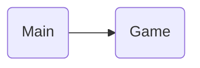

# Galo da Velha
#### By Bruno Alegria a22302942, Ivan Emídio a22301234, Mariana Martins a22302203
##### Linguagens de Programação I - Projeto 1
[Project's Git link](https://github.com/notCroptu/LP1Proj01.git)

### Task List
| When | Who | What |
| --- | --- | --- |
| 29/3 | Mariana Martins | Created git |
| 29/3 | Mariana Martins | Added solution and project |
| 29/3 | Mariana Martins | Formated README.md in markdown |
| 30/3 | Bruno Alegria | Updated README.md |                                                          /// especificar
| 1/4 | Mariana Martins | Added Architecture description and references |                    /// tipo aqui, eu espcifiquei references
| 1/4 | Mariana Martins | Created Class Game in Game.cs |
| 1/4 | Ivan Emidio | Created Class Board in Board.cs |
| 1/4 | Ivan Emidio | Added Code to the Board in Board.cs |                                        /// especifica pls
| 1/4 | Ivan Emidio | Looped the Board in Game.cs |
| 1/4 | Ivan Emidio | Created Class Piece in Piece.cs |
| 1/4 | Ivan Emidio | Added Coordinates to Pieces in Piece.cs |     /// bruh? porque dizer isto em especifico e deixar o resto todo?
| 1/4 | Ivan Emidio | Updated README.md |
| 1/4 | Mariana Martins | Created CreatePieces Method in Board Class |
| 1/4 | Mariana Martins | Created PiecesChar Enumeration in PiecesChar.cs |
| 2/4 | Mariana Martins | Scripted Render method in Board Class |
| 2/4 | Mariana Martins | Created unicodeModify method and other getters in Piece class |
| 2/4 | Mariana Martins | Updated references in README |
| 2/4 | Mariana Martins | Created Player Class in Player.cs |
| 2/4 | Mariana Martins | Added script to Game class loop |

---
## Architecture

> here goes the description (organizations and non trivial algorithms)

    Our project is organized between 4 classes, Game, Board, Player and Piece. Where Game initiates the instances necessary for the program and has the game loop, Board is an object with the state of the game board and all the Piece Objects in it in a Pieces array, Player has the methods necessary for the moves the player can take, and Piece is an object that is instantiated with an enumeration and has its own string identifier.

> here goes the fluxogram (steps walked through in the program)

---
## References
#### Ideas
* Mariana - To have 4 classes for the project, and deal with the window in the Game class.
* Mariana - use and enumeration with bit by bit to identify pieces
* Mariana - have an array for the board where we place the pieces, and is read in a for when we want to check is the piece is in use
#### Ai Code
#### Open Code
* [Stack Overflow, How to draw tables](https://stackoverflow.com/questions/856845/how-to-best-way-to-draw-table-in-console-app-c)
#### Libraries
* [Markdown cheat sheet](https://www.markdownguide.org/cheat-sheet/) 
* [Markdown docs](https://paperhive.org/help/markdown)
* [Mermaid docs](https://mermaid.js.org/syntax/flowchart.html)
* https://www.w3schools.com/cs/cs_arrays_multi.php
* https://www.w3schools.com/cs/cs_classes.php
* https://www.w3schools.com/cs/cs_constructors.php                            // ivan referencia isto sem ser so links bruv
