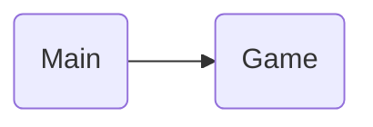

# Galo da Velha
#### By Bruno Alegria a22302942, Ivan Emídio a22301234, Mariana Martins a22302203
##### Linguagens de Programação I - Projeto 1
[Project's Git link](https://github.com/notCroptu/LP1Proj01.git)

### Task List
| When | Who | What |
| --- | --- | --- |
| 29/3 | Mariana Martins | Created git |
| 29/3 | Mariana Martins | Added solution and project |
| 29/3 | Mariana Martins | Formated README.md in markdown |
| 30/3 | Bruno Alegria | Updated header of README.md |
| 1/4 | Mariana Martins | Added Architecture description and references |
| 1/4 | Mariana Martins | Created Class Game in Game.cs |
| 1/4 | Ivan Emidio | Created Class Board in Board.cs |
| 1/4 | Ivan Emidio | Added Code to the Board in Board.cs |
| 1/4 | Ivan Emidio | Looped the Board in Game.cs |
| 1/4 | Ivan Emidio | Created Class Piece in Piece.cs |
| 1/4 | Ivan Emidio | Updated README.md |
| 1/4 | Mariana Martins | Created CreatePieces Method in Board Class |
| 1/4 | Mariana Martins | Created PiecesChar Enumeration in PiecesChar.cs |
| 2/4 | Mariana Martins | Scripted Render method in Board Class |
| 2/4 | Mariana Martins | Created unicodeModify method and other getters in Piece class |
| 2/4 | Mariana Martins | Updated references in README |
| 2/4 | Mariana Martins | Created Player Class in Player.cs |
| 2/4 | Mariana Martins | Added script to Game class loop |
| 3/4 | Mariana Martins | Added player instances to Game.cs and created switchPlayer method to Game.cs |
| 3/4 | Mariana Martins | Created CheckInput methods in Game.cs |
| 3/4 | Mariana Martins | Created ConvertInput methods and getters in Player class |
| 3/4 | Mariana Martins | Created getters in Piece class |
| 3/4 | Mariana Martins | Added name input in Start method, name variable in Player class and GetName method |
| 3/4 | Mariana Martins | Edited game loop in Start method to include new methods |
| 3/4 | Bruno Alegria | Created PiecePlacer method in Board.cs |
| 3/4 | Bruno Alegria | Added the PiecePlacer attributes (piece and coordinates) |
| 3/4 | Bruno Alegria | Update README.md's change log |
| 4/4 | Mariana Martins | Edited the PiecePlacer method in board.cs |
| 4/4 | Mariana Martins | Added getter methods to board class |
| 4/4 | Mariana Martins | Reordered and added methods to the game loop logic |
| 4/4 | Mariana Martins | Update README.md's change log |
| 4/4 | Mariana Martins | Edited ConvertPieceInput and ConvertPlaceInput method in Player class |
| 4/4 | Mariana Martins | Fixed errors in Game.cs, missing ;, break, {} etc. |
| 4/4 | Mariana Martins | Fixed errors in Board.cs, missing null check and loop errors |
| 4/4 | Mariana Martins | Fixed errors in Piece.cs, method name wrong, missing null check |
| 4/4 | Mariana Martins | Fixed errors in Player.cs, wrong variable called |
| 4/4 | Bruno Alegria | Modified methods GetName, GetLastPieceInput and GetLastPlaceInput to lambdas in Player.cs |
| 4/4 | Bruno Alegria | Modified methods GetUnicoded and GetChars to lambdas in Piece.cs |
| 4/4 | Mariana Martins | Edited Render method in Board class |
| 5/4 | Ivan Emidio | Fixed errors, PieceChar -> PiecesChar |
| 5/4 | Mariana Martins | Edited CreatePieces method in Board class |
| 5/4 | Mariana Martins | Added Invalid enum in PiecesChar and applied in ConvertInput and CheckInput methods |
| 5/4 | Mariana Martins | Edited ConvertInput methods to add flexibitlity to input, and added XML documentation |
| 5/4 | Mariana Martins | Created ShowAvailable method in Board class |
| 5/4 | Mariana Martins | Edited issues with ConvertInput Methods and Game loop method in Player Game class |
| 5/4 | Mariana Martins | Added error messages in ConvertInput methods and edited game loop |
| 5/4 | Bruno Alegria | Modified class Board description and transformed methods GetpiecesLeft and Getboard to lambdas in Board.cs |
| 5/4 | Mariana Martins | Edited CheckInput methods, to include checking for availability of piece and placement |
| 5/4 | Mariana Martins | Fixed CreatePieces method in board, the ifs were giving true at wrong times |
| 5/4 | Mariana Martins | Fixed CheckInput for loop in Game class |
| 5/4 | Mariana Martins | Added a null check in CheckInput in Game class, and changed spacing between renderings in game loop 
| 5/4 | Mariana Martins | Edited ConvertPieceInput in Player class |
| 5/4 | Bruno Alegria | Added a way to print the available pieces to ShowAvailable in Board.cs |
| 5/4 | Bruno Alegria | Added XML documentation and comments to ShowAvailable in Board.cs |
| 5/4 | Mariana Martins | Created CheckWin method in board class and included it in the game loop |
| 5/4 | Mariana Martins | Edited ShowAvailable in Board.cs |
| 5/4 | Mariana Martins | Added for loop to check for a horizontal win in WinChecker in Board.cs |
| 6/4 | Ivan Emidio | Added 3 Examples of winning the Game to the Method Render in Board.cs|
| 6/4 | Ivan Emidio | Updated Readme.md |
| 6/4 | Mariana Martins | Added for loop to check for a vertical and diagonal and edited horizontal win in WinChecker in Board.cs |
| 6/4 | Mariana Martins | Added XML documentation for WinChecker in Board.cs |
| 6/4 | Mariana Martins | Edited winning examples in Render method in Board.cs and fixed errors in Board and Game classes |
| 6/4 | Mariana Martins | Edited and fixed errors in Render and WinCheck methods in Board.cs class |
| 6/4 | Mariana Martins | Added documentation in Start method in Game class |
| 6/4 | Mariana Martins | Edited References and Description in README.md |
| 7/4 | Mariana Martins | Added instructions to Start method in Game class |
| 7/4 | Mariana Martins | Edited Game loop in Start method in Game class |
| 7/4 | Mariana Martins | Removed debugging tools in ConvertPlaceInput in Player class |

---
## Architecture

#### Organizations and Algorithms

Our project is organized around four main classes: Game, Board, Player, and Piece.

* Game: This class serves as the orchestrator of the game, responsible for initializing the necessary instances and managing the game loop. It begins by prompting players for their names and providing instructions on how to play and win.
* Board: An object representing the game board, storing the state of the game as well as all the Piece objects within it in two arrays: piecesLeft and board.
* Player: This class contains methods necessary for player actions and moves within the game.
* Piece: An object instantiated with an enumeration, each with its own string unicoded.

Additionally, we utilize an Enum called PiecesChar, which defines characteristics such as BigOrSmall, WhiteOrBlack, CircleOrSquare, and HoleOrNoHole within Piece objects, with an additional flag for Invalid set to -1.

The game starts by initializing a Game object and invoking its Start method, which provides instructions and gathers player names. Then, the game loop begins.

During each iteration of the game loop:

1. Calls ShowAvailable and Render to have the rendering of the current game board situation, available pieces and other helpful information like commands, symbols, and ways to win.
2. Then a Winning situation is checked for according to the last played placement in the board in the current referenced player, which is initially be set to [0,0].

3. Inside the body of the Game loop.

   * Two similar sections run for input, the first verifying for a piece input, the second for a place input, but both work the same way. Here is the first for reference:

     1. We enter a white (true).
     2. There we have an If, checking if the player's input == exit, if true, the Game loop breaks.
     3. Inside the Else If, the first player (and current referenced Player) is asked what piece to be moved.
     4. The input is then converted into either a valid PiecesChar or an Invalid PiecesChar that is saved in LastPieceInput inside the referenced Player (with the ConvertPieceInput method also inside Player).
     5. Then, that LastPieceInput is checked with CheckInput method in an if, returning true if valid and breaking the while loop, else an error message appears and the player is promoted again.

     * In the middle of these two input sections, the player being referenced is changed.

4. After, The Piece is finally placed inside the board rendering, with the method PiecePlacer, and the loop repeats.

#### Fluxogram


---
## References
#### Ideas
* Mariana - To have 4 classes for the project, and deal with the window in the Game class.
* Mariana - use and enumeration with bit by bit to identify pieces
* Mariana - have an array for the board where we place the pieces, and is read in a for when we want to check is the piece is in use
#### Ai Code
* ChatGPT
  * "in c# how do i create and add an object to an array"
        ```
        // Create a list to hold your objects
        List<MyObject> objectList = new List<MyObject>();

        // Create your object
        MyObject obj1 = new MyObject("Object 1");

        // Add your object to the list
        objectList.Add(obj1);
        ```
  * give me some examples of this x % y
        ```
        int x = 10;
        int y = 3;
        int result = x % y; // result will be 1 because 10 divided by 3 leaves a remainder of 1
        ```
  * how do i initialize a rectangular array
        ```
        elementType[,] arrayName = new elementType[rows, columns];
        ```
  * how to add unicode character to string
        ```
        string myString = "Hello \u2665 World";
        ```
  * how do i use this unicode for c# U+1F573
        ```
        string myString = "\U0001F573";
        ```
  * how do i create an array with a string separated by the strings spaces
        ```
        string inputString = "apple banana cherry";

        string[] array = inputString.Split(' ');

        // Now 'array' contains ["apple", "banana", "cherry"]
        ```
  * how do i in bitwise make a bit always turn to a 0 or always turn to a 1
        ```
        int number = 0b10101010; // Example number

        // Set bit at position 3 to 0
        int maskToZero = ~(1 << 3);
        int resultZero = number & maskToZero;

        // Set bit at position 4 to 1
        int maskToOne = 1 << 4;
        int resultOne = number | maskToOne;

        Console.WriteLine(Convert.ToString(resultZero, 2)); // Output: 10100010
        Console.WriteLine(Convert.ToString(resultOne, 2)); // Output: 10111010
        ```
  * if input is a string, can i do input[1] to get a specific character
    * Yes, you can use indexing with square brackets [] on a string in C# to access individual characters at specific positions.
  * how to make a char into an int
        ```
        char myChar = 'A';
        int myInt = (int)myChar;
        ```
  * how to pass string to int
        ```
        string str = "123";
        int number = int.Parse(str);
        ```
  * how do i make sure that my unicode characters show up on any console
        ```
        Console.OutputEncoding = System.Text.Encoding.UTF8;
        ```
#### Open Code
* [Stack Overflow, How to draw tables](https://stackoverflow.com/questions/856845/how-to-best-way-to-draw-table-in-console-app-c)
#### Libraries
* [Markdown cheat sheet](https://www.markdownguide.org/cheat-sheet/) 
* [Markdown docs](https://paperhive.org/help/markdown)
* [Mermaid docs](https://mermaid.js.org/syntax/flowchart.html)
* [W3 Schools](https://www.w3schools.com/)
* [Techno Kids - Flowchart for Programming](https://blog.technokids.com/programming/how-to-make-a-flowchart-for-programming-easy-to-understand/#:~:text=When%20creating%20a%20flowchart%20to,show%20the%20flow%20of%20information.)
